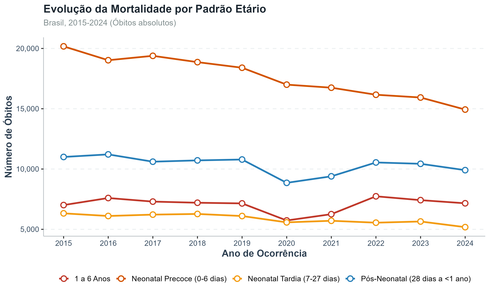
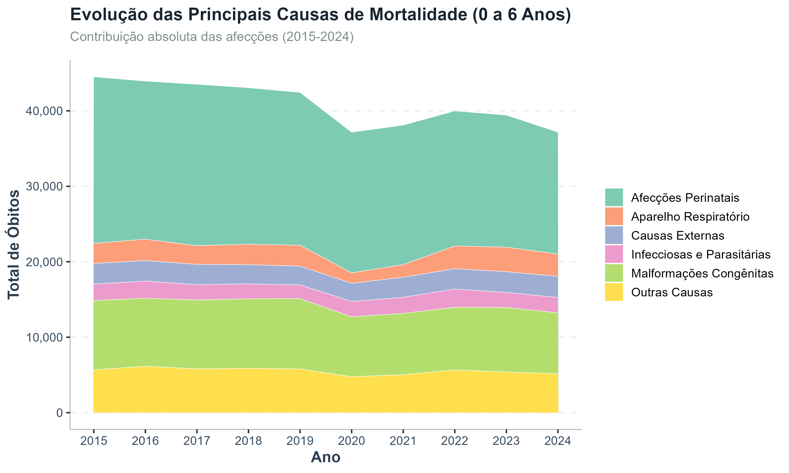
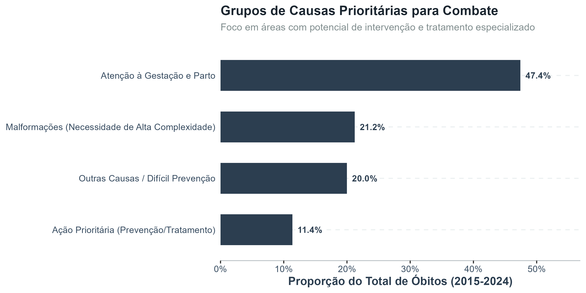
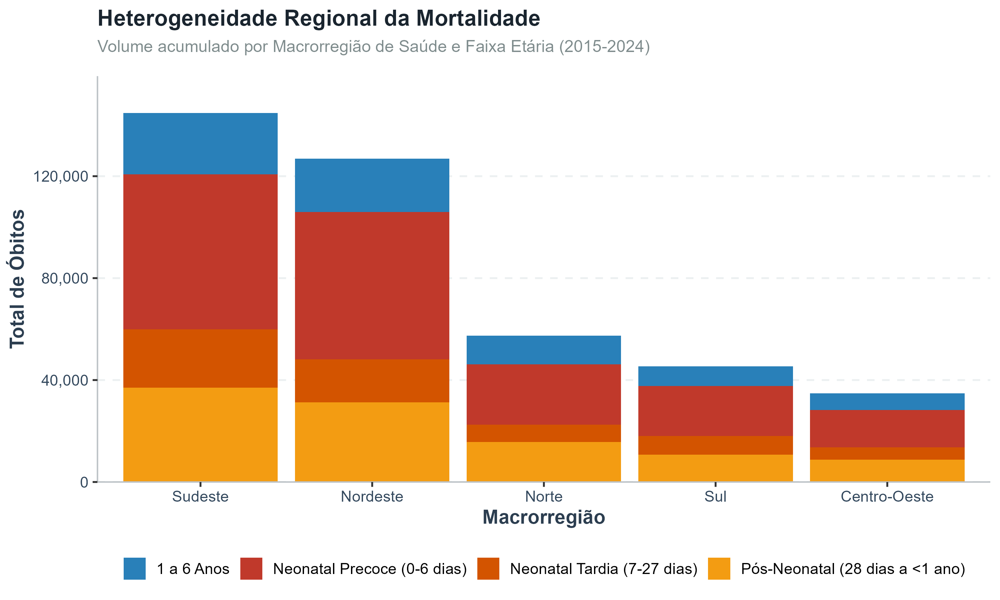
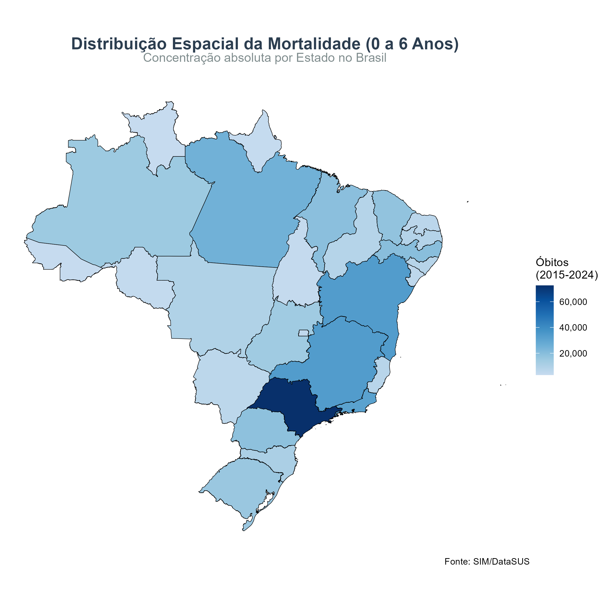

# SIM + SIH: Mortalidade e Internações (0 a 6 anos) no Brasil

Projeto público em R para análise reprodutível da mortalidade (SIM) e internações hospitalares (SIH) em crianças de 0 a 6 anos no Brasil.

---

## População de interesse

Este projeto analisa exclusivamente crianças de **0 a 6 anos de idade**, incluindo:

- Neonatal precoce (0–6 dias)  
- Neonatal tardia (7–27 dias)  
- Pós-neonatal (28 dias a <1 ano)  
- 1 a 6 anos  

Todos os dados, análises e visualizações são restritos a essa faixa etária.

---

## Objetivos

- Descrever a evolução temporal da mortalidade em crianças de 0 a 6 anos no Brasil  
- Caracterizar padrões de internação hospitalar (SIH) na mesma faixa etária  
- Avaliar desigualdades regionais na mortalidade e internações  
- Identificar causas prioritárias de morte com potencial de intervenção  
- Integrar evidências de mortalidade e hospitalização para suporte à decisão em saúde pública  

---

## Recorte temporal

Período analisado: **2015 a 2024**

---

## Unidade de análise

Óbitos e internações hospitalares em crianças de 0 a 6 anos, agregados por:

- Ano  
- Macrorregião  
- Estado  
- Causa básica (CID-10)  

---

## Principais resultados

### Evolução da mortalidade por faixa etária


### Evolução das principais causas


### Causas prioritárias para intervenção


### Heterogeneidade regional


### Distribuição espacial da mortalidade


---

## Fonte de dados

- SIM (Sistema de Informações sobre Mortalidade)  
- SIH (Sistema de Informações Hospitalares)  
- DataSUS  
- Extração via pacote `microdatasus` (R)

---

## Estrutura do projeto

- `scripts/`: download, limpeza e análise dos dados  
- `outputs/figuras/`: visualizações finais  
- `outputs/tabelas/`: tabelas analíticas  
- `docs/`: documentação complementar  

---

## Reprodutibilidade

Para reproduzir as análises:

```r
source("scripts/01_download_preparo_sim_0a6.R")
source("scripts/02_analises_sim_0a6.R")
