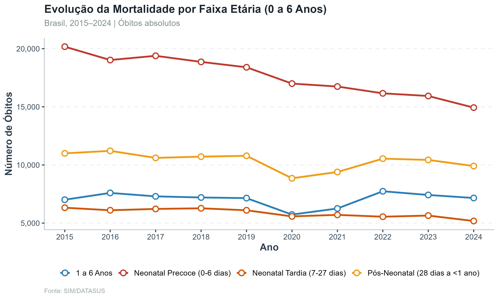
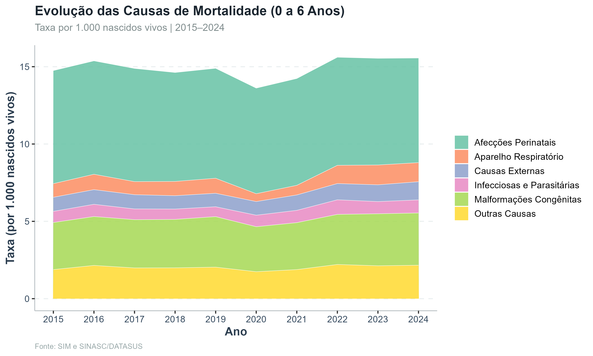
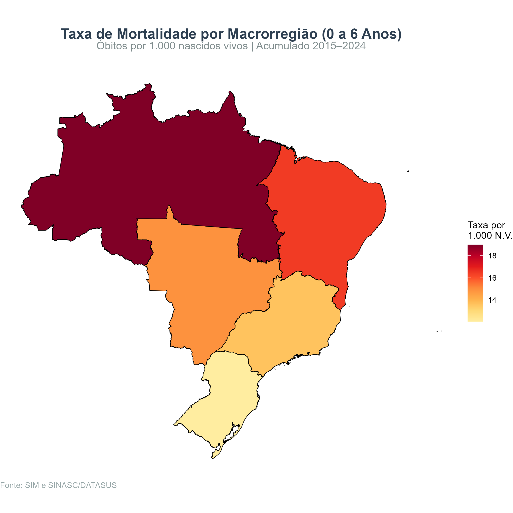
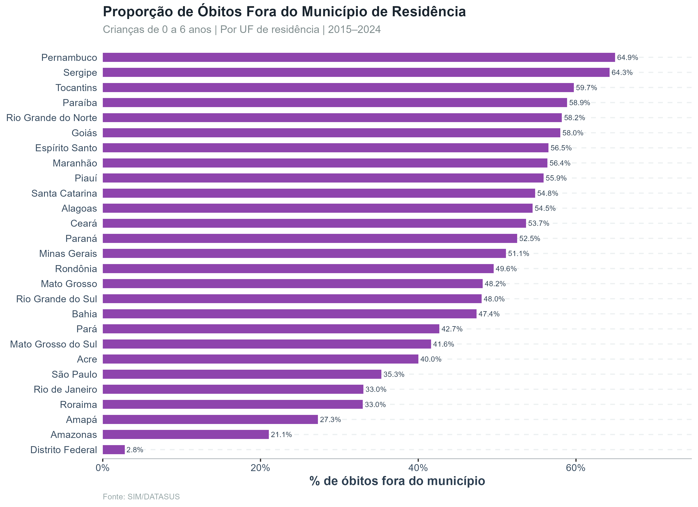
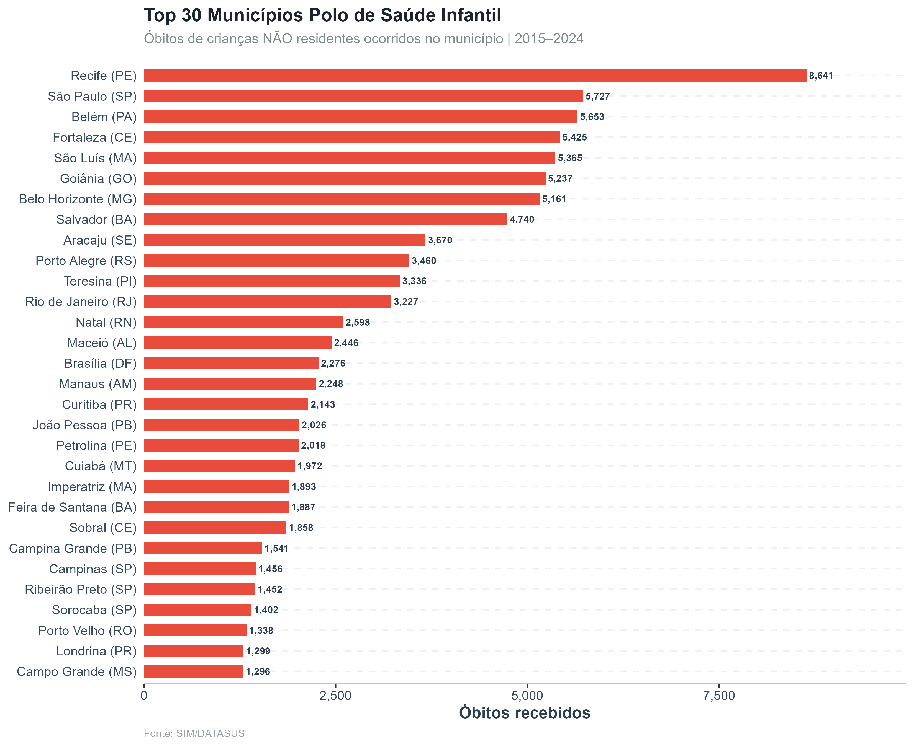

<div align="center">
  <h1>📊 SIM + SIH: Mortalidade e Internações (0 a 6 anos) no Brasil</h1>
  <p><strong>Projeto de análise reprodutível de dados de saúde pública (2015-2024)</strong></p>
</div>

---

## 📌 Resumo Executivo

Este projeto apresenta um mapeamento detalhado e de alto rigor epidemiológico sobre a **mortalidade e internação de crianças na primeira infância (0 a 6 anos)** no Brasil. O objetivo é fornecer subsídios baseados em dados para a formulação de políticas públicas, identificação de gargalos no SUS e direcionamento de recursos para as áreas e causas mais críticas.

**Recorte Etário Analisado:**
* Neonatal precoce (0–6 dias)
* Neonatal tardia (7–27 dias)
* Pós-neonatal (28 dias a <1 ano)
* 1 a 6 anos

---

## 🔬 Nota Metodológica de Excelência

Para garantir a máxima precisão das **Taxas de Mortalidade Infantil (TMI)**, este estudo substitui as estimativas populacionais intercensitárias convencionais pelo número real de **Nascidos Vivos (SINASC)** do mesmo período e localidade como denominador. As taxas são padronizadas por **1.000 nascidos vivos**, refletindo o padrão-ouro da epidemiologia em saúde pública.

**Fontes de Dados Oficiais:**
* **SIM** (Sistema de Informações sobre Mortalidade)
* **SINASC** (Sistema de Informações sobre Nascidos Vivos)
* **SIH** (Sistema de Informações Hospitalares)
* **Extração:** DataSUS (via R/microdatasus e TabNet)

---

## 📈 Resultados e Painel de Indicadores

> *Todas as análises e rotinas de extração foram desenvolvidas em ambiente R e os scripts completos estão disponíveis neste repositório.*

### 1. Perfil Temporal e Causal da Mortalidade

**Evolução da Mortalidade por Faixa Etária (Óbitos Absolutos)**
<div align="center">
  
</div>

**Evolução das Causas de Mortalidade (Taxa por 1.000 Nascidos Vivos)**
<div align="center">
  
</div>

**Causas Prioritárias de Intervenção Estratégica**
<div align="center">
  
</div>

---

### 2. Análise Espacial e Desigualdades Regionais

**Heterogeneidade Regional (Taxa Média)**
<div align="center">
  
</div>

**Distribuição Espacial da Taxa de Mortalidade por Estado**
<div align="center">
  
</div>

**Distribuição Espacial da Taxa de Mortalidade por Macrorregião**
<div align="center">
  
</div>

---

### 3. Análise de Fluxo e Rede de Atendimento (Gargalos do SUS)

A identificação do fluxo de pacientes cruza o **Município de Residência** com o **Município de Ocorrência** do óbito, revelando a dependência interestadual e a sobrecarga de polos regionais de saúde.

**Proporção de Óbitos Ocorridos Fora do Município de Residência**
<div align="center">
  
</div>

**Top 30 Municípios Polo de Saúde Infantil (Sobrecarga de Não-Residentes)**
<div align="center">
  
</div>

**Mapa de Calor: Fluxo Inter-Estadual de Mortalidade (Residência → Óbito)**
<div align="center">
  
</div>

---

## 📂 Estrutura do Repositório

* `scripts/`: Códigos-fonte em R para extração, limpeza, cruzamento (linkage) e geração de dataviz.
* `dados/`: Diretório configurado no `.gitignore` para proteção de microdados brutos e respeito à volumetria do repositório.
* **Tabelas Executivas:** O arquivo [Tabelas_Executivas_Mortalidade_v2.xlsx](outputs/tabelas/Tabelas_Executivas_Mortalidade_v2.xlsx) contendo os dados sumarizados está disponível na pasta `outputs/tabelas/` para download e consulta rápida.
* `docs/`: Dicionários de variáveis e metadados.

## 💻 Reprodutibilidade

Para auditores, pesquisadores e gestores que desejem reproduzir o painel:

```r
# Clone o repositório e adicione as bases brutas na pasta dados/
# Execute os scripts de rotina:
source("scripts/01_download_preparo_sim_0a6.R")
source("scripts/02_analises_sim_0a6.R")
